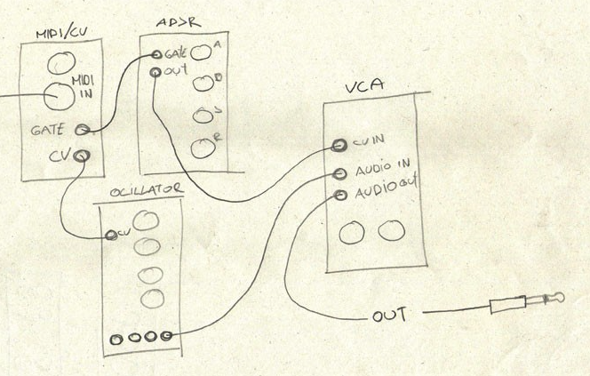

# How to combine use ADSR in conjunction with a VCO and a VCA

When I first started using eurorack modules to generate sounds from an external MIDI source such as
Ableton USB/Midi, or a MIDI keyboard, I frankly did not understand even understand why, when I connected
my case's CV out to a VCA 1V/OCT in, the note "hung" until another distinct note was triggered. After
spending a few minutes looking at my Korg MS-20 (one of the best ways to understand mmodular synthesis
without breaking the bank), that it's comrised of 4 basic things at it's core.

Note: _Forget about portamento/slew, patch bay, patch bay controls, master tuning, VCO 2 tuning, and
everything else for now... We're focusing on probably the three most important things..._

1. Dual VCO's with attenuation and amplitude
2. HP/LP Filters
3. Modulation
4. Envelope Generators 1 and 2 (ADSR)

Sounds pretty basic? That's because it is...

I know that a modular rig is not necessarily meant to be a synthesizer, or anything tangible for that
matter. That modules can be used in any way capable, and that there are no real rules and also that all modules
can be use in a multitude of ways: The right way, the wrong way, some new better
way, a detremental way (Ask me about what happened to my Clouds &copy; module some day), or any other way you
can think of.

However, the things I valued early on in building my rig out were big ticket items such as Clouds,
Maths, VCO's, Plaits, Filters, etc... It wasn't until I had already invested quite a bit of money in VCA's and
modulation sources that, without VCA's and ADSR, I would have no control over the lifespan, shape, or sensitivity
of a note, making basic musical concepts such as staccato on arpeggios, pads (basically a slow attack and a
fair a ount of sustain), or the "LEVELS" of any of my prized modulation or oscillator sources... It wasn't long
before I realized I wanted to not only understand the concepts and applications of VCA's and Envelope Generators,
but that I could notconsider my rig a real "Instrument" without them.

So, after using the MS-20's ADSR via the external patch bay, I finally understood what I was missing. So I patched into the MS-20, but found
the EG1 (the only enveelope generator I could figure out how to use via an external source) to be a shit Envelope Generator without any
fancy features such as "Level", "End of Decay Triggers", "Re-triggering", etc..., and also, not fully understanding ADSR at the time,
I looked at probably every available ADSR module on the market.

I found Intellijel's Dual ADSR to be not only the most functional and solid EG on the market, but the most versatile as well.
I won't get into an Intellijel commercial here, but every EG I've ever seen has been aligned vertically. This forces the user to have to abstract
and I may have lost you here, but let me explain.

Since most of the time in math, we think about the Y-Axis as some kind of "amount" and the X-Axis as "Time" moving in a linear forward direction (for now...)
So when you think about ADSR, and plot it on a graph, every graph I've ever seen is basically a curved graph of attack, decay, sustain, and release plotted
horizontally on the X-Axis over time. But to save space, most manufacturer's lay out thier EG's like so:

| A | (0-100) |
| D | (0-100) |
| S | (0-100) |
| R | (0-100) |

rather than:

| (0-100) | (0-100) | (0-100) | (0-100) |
| A | D | S | R |

which forces the user to invert the axis and that can throw a lot of people of, and is not intuitive in any way unless you really really get
ADSR on a conceptual level and understand that they are event behaviora over time, and that a linear layout would be nice.

The Intelllijel Dual ADSR not only has laid out each event linearly, but they use sliders instead of knobs and also there are two channels
that can be used independantly or combined and also have functionality to perform operation on "End of Decay", ways of altering the signal,
ways of controlling the Level of the EG, and more...

Today we're going to just focus on the Level of the ADSR, and how to use it in conjunction with a VCO and a VCA.

For this lesson, I'm going to blatantly rip off a drawing from
[the following arcticle](https://jaus.co/house-techno-music-magazine/how-to-connect-oscillator-vca-adsr/)

Here is the crude drawing that changed my whole world:

